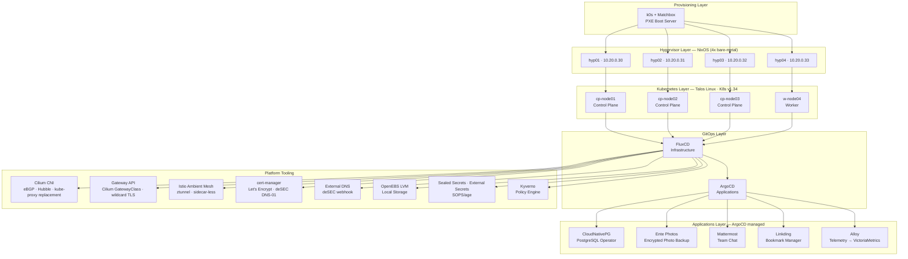

# Homelab

Bare-metal Kubernetes platform built from scratch -- from PXE boot to production-grade cluster tooling, with ArgoCD-managed application deployments.

**Built by:** [Waldemar Kubica](https://gitlab.com/ebi-droid) and [Jakub Kubica](https://gitlab.com/beraton)

[](https://kubernetes.io)
[](https://www.talos.dev)
[](#nixos-hypervisor-hosts)
[](#kubernetes-cluster)
[](#platform-tooling-fluxcd)
[](#platform-tooling-fluxcd)
[](#key-design-decisions)
[](#network)

---

## Why is this lab build?

Both of us ([@ebi-droid](https://gitlab.com/ebi-droid) and [@beraton](https://gitlab.com/beraton)) are true Cloud Infrastructure and GitOps enthusiasts and are professionally associated with Cloud Engineering. This branch of IT is during constant evolution as more and more new technologies emerge on the market, especially after ubiquitous implementation of AI solutions.

At some point we realized that we lack a place to test and verify those technologies/tools. This was the main reason behind building this lab was - to create a place for education and learning DevOps/GitOps craft in a most possible and affordable production-grade setup.

GitOps approach includes creating reproducible, declarative and reliable systems - from start to finish. This is why our hardware is build on the basis on NixOS combined with Talos. Both of those technologies allow us to deploy our hardware and set up underlying OS for k8s clusters in a reliable, standardized way, with great documentation and very active community.

## Architecture



## Network

4 VLANs with Open vSwitch bridging on each hypervisor:

| VLAN | Subnet       | Purpose                                 |
|------|--------------|-----------------------------------------|
| 10   | 10.10.0.0/16 | PXE boot and provisioning               |
| 20   | 10.20.0.0/16 | Hypervisor management                   |
| 30   | 10.30.0.0/16 | Kubernetes cluster (API, etcd, inter-node) |
| 40   | 10.40.0.0/16 | Services and BGP (LoadBalancer IPs)     |

**BGP peering:** Cluster nodes (ASN 65000) ↔ ToR switch (ASN 65001) on VLAN 40. LoadBalancer IPs (10.40.0.150-160) are advertised via eBGP with ECMP across all nodes.

## Repository Structure

```
homelab/
├── 00-pxe-bootstrap/         # Bare-metal provisioning (PXE, Matchbox)
├── 01-virtualization/    # NixOS hypervisors, libvirt, OVS
├── 02-kubernetes/        # Talos Linux cluster configs
├── 03-flux-apps/         # FluxCD-managed platform tools (Cilium, cert-manager, etc.)
├── 04-argocd-apps/       # ArgoCD-managed application deployments
│   ├── alloy/            # Grafana Alloy telemetry collector
│   ├── cloudnativepg/    # PostgreSQL operator
│   ├── diagnostic-app/   # Test workloads (custom chart)
│   ├── ente/             # Ente Photos + CNPG + HTTPRoutes
│   ├── linkding/         # Bookmark manager + PVC + HTTPRoute
│   ├── mattermost/       # Operator + CRDs + installation + CNPG database
│   └── nginx/            # Minimal test deployment
├── docs/
│   └── adr/              # Architecture Decision Records
├── sources/              # Custom Helm charts
│   └── charts/
│       ├── diagnostic-app/
│       └── common/
├── app-of-apps.yaml      # Root ArgoCD Application
├── devbox.json
└── README.md
```

## Infrastructure

### PXE Boot Server

Single-node k0s cluster hosting a [Matchbox](https://matchbox.psdn.io/) PXE server for network booting bare-metal machines.

- k0s with Calico CNI (VXLAN)
- Matchbox v0.11.0 in hostNetwork mode
- SOPS+age encrypted kubeconfig

### NixOS Hypervisor Hosts

4 NixOS bare-metal hypervisors managed declaratively with Nix Flakes and deployed remotely via deploy-rs.

| Host  | Management IP | Hardware         |
|-------|---------------|------------------|
| hyp01 | 10.20.0.30   | NVMe, AMD/Intel  |
| hyp02 | 10.20.0.31   | NVMe, AMD/Intel  |
| hyp03 | 10.20.0.32   | NVMe, AMD/Intel  |
| hyp04 | 10.20.0.33   | NVMe, AMD/Intel  |

### Kubernetes Cluster

Talos Linux cluster managed with [talhelper](https://budimanjojo.github.io/talhelper/). Dual-homed nodes with separate cluster and service networks.

| Node      | VLAN 30 (cluster) | VLAN 40 (services) | Role          |
|-----------|--------------------|--------------------|---------------|
| cp-node01 | 10.30.0.29         | 10.40.0.29         | Control Plane |
| cp-node02 | 10.30.0.31         | 10.40.0.31         | Control Plane |
| cp-node03 | 10.30.0.32         | 10.40.0.32         | Control Plane |
| w-node04  | 10.30.0.33         | 10.40.0.33         | Worker        |

- **K8s version:** v1.34.0 | **Talos version:** v1.12.4
- **API VIP:** 10.30.0.200
- **Pod CIDR:** 10.244.0.0/16 | **Service CIDR:** 10.96.0.0/12

### Platform Tooling (FluxCD)

| Tool | Version | Purpose |
|------|---------|---------|
| Cilium | 1.18.5 | CNI, eBGP, kube-proxy replacement, Gateway API, Hubble |
| ArgoCD | 9.4.15 | GitOps for applications |
| cert-manager | 1.19.2 | TLS certificates (Let's Encrypt via deSEC DNS-01) |
| Gateway API | -- | Internal + external gateways |
| Istio Ambient | 1.29.1 | Sidecar-less service mesh (ztunnel) |
| OpenEBS | 4.0.0 | LVM-based local storage |
| Sealed Secrets | 2.18.0 | Encrypted secrets in git |
| External Secrets | >=1.15.0 | External secrets operator |
| External DNS | 1.20.0 | Automatic DNS (deSEC webhook) |
| Kyverno | 3.7.0 | Kubernetes policy engine |

## Applications (ArgoCD)

ArgoCD is deployed by FluxCD and manages applications via the App-of-Apps pattern. The root `app-of-apps.yaml` discovers everything in `04-argocd-apps/`.

| Application | Purpose |
|-------------|---------|
| CloudNativePG | PostgreSQL operator (foundation for app databases) |
| Ente Photos | End-to-end encrypted photo backup |
| Mattermost | Team chat with operator pattern |
| Linkding | Bookmark manager |
| Alloy | Telemetry collector → VictoriaMetrics |

### Patterns

| Pattern | Implementation |
|---------|---------------|
| **Routing** | Gateway API HTTPRoutes via `internal-gateway`, domain `*.akna.one.pl` |
| **DNS** | External-DNS annotations on HTTPRoutes |
| **Databases** | CloudNativePG clusters (PostgreSQL 17, 2 instances, anti-affinity) |
| **Storage** | `openebs-lvm` StorageClass |
| **Secrets** | SealedSecrets (Bitnami) for credentials in git |
| **Monitoring** | Alloy scrapes → VictoriaMetrics, Beyla eBPF instrumentation |

## Key Design Decisions

- **Why Talos Linux:** Immutable, API-driven, minimal attack surface. No SSH, no shell, no package manager on nodes.
- **Why Cilium with BGP:** eBPF-based datapath, native LoadBalancer IP advertisement, kube-proxy replacement, Gateway API.
- **Why dual GitOps (FluxCD + ArgoCD):** FluxCD manages platform tools (infrastructure), ArgoCD manages applications (developer concern). Different lifecycles, different blast radii.
- **Why NixOS for hypervisors:** Reproducible host configuration, atomic upgrades/rollbacks, declarative VM and network definitions.
- **Why Gateway API over Ingress:** Role-oriented API, multi-protocol support, portable across implementations.

## Security

- All secrets encrypted with SOPS+age. Decrypted only to `/dev/shm` (tmpfs), never to persistent disk.
- Sealed Secrets for Kubernetes secrets committed to git.
- No plaintext credentials in the repository.

## Contributors

- **Waldemar Kubica** ([@ebi-droid](https://gitlab.com/ebi-droid)) -- Architecture and design, NixOS hypervisors, Talos cluster, PXE boot, FluxCD, Cilium CNI + BGP, Gateway API, cert-manager, ArgoCD, Istio Ambient, Kyverno, External DNS, Sealed Secrets, observability stack, network architecture, application operations
- **Jakub Kubica** ([@beraton](https://gitlab.com/beraton)) -- Democratic-CSI storage, OpenEBS LVM, diagnostic tooling, Ente Photos, Linkding, Mattermost operator setup, custom Helm charts
