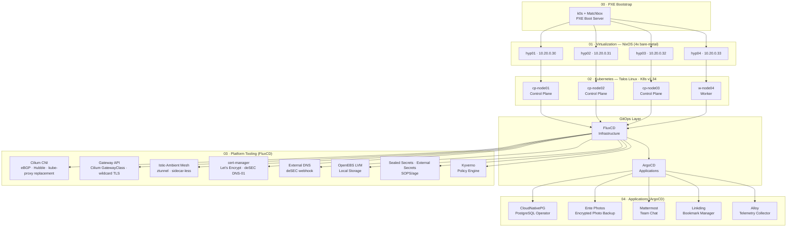

# Homelab — Bare-Metal Kubernetes Platform

[](https://kubernetes.io)
[](https://www.talos.dev)
[](./01-virtualization/)
[](./03-flux-apps/01.cilium/)
[](./03-flux-apps/22.istio-ambient/)
[](./docs/adr/ADR-3-dual-gitops.md)
[](LICENSE)

---

An **over-engineered, production-grade Kubernetes homelab** built entirely from scratch. From PXE-booting bare metal to running real applications behind a service mesh — everything is declarative, version-controlled, and GitOps-driven.

**Built by:** [Waldemar Kubica](https://github.com/ebi-droid) · [Jakub Kubica (Beraton)](https://github.com/beraton)

---

## Why This Lab Exists

> *"We don't have a place to break things safely."*

We are cloud infrastructure engineers who need a realistic sandbox to practice, experiment, and stay current. This lab exists to:

1. **Test production-grade patterns** — Cilium eBGP, Istio Ambient Mesh, Gateway API, dual GitOps — without risking a real production environment.
2. **Learn by doing** — Every tool here was chosen because we wanted to understand it deeply, not because it was the easiest option.
3. **Build a portfolio** — This repository is a live artifact showing real engineering decisions, real debugging, and real operational work.
4. **Collaborate** — Two engineers sharing a codebase, reviewing each others' changes, and growing together.

## Architecture



## Network Topology

4 VLANs with **Open vSwitch** bridging on each hypervisor. eBGP between cluster and ToR switch.

| VLAN | Subnet | Purpose | Routing |
|------|--------|---------|---------|
| 10 | 10.10.0.0/16 | PXE boot & provisioning | Static |
| 20 | 10.20.0.0/16 | Hypervisor management | Static |
| 30 | 10.30.0.0/16 | Kubernetes cluster | Internal |
| 40 | 10.40.0.0/16 | Services & LoadBalancer IPs | eBGP (ASN 65000 ↔ 65001) |

**BGP:** 4 nodes advertise 10.40.0.150–160 via eBGP to ToR switch (ASN 65001) with ECMP.

## Repository Layout

```
homelab/
├── 00-pxe-bootstrap/         # PXE boot with Matchbox (k0s cluster)
├── 01-virtualization/        # NixOS hypervisors, libvirt, OVS
├── 02-kubernetes/            # Talos Linux cluster (talhelper)
├── 03-flux-apps/             # FluxCD-managed platform tools
├── 04-argocd-apps/            # ArgoCD-managed applications
├── docs/                    # Documentation & ADRs
│   ├── adr/                  # Architecture Decision Records
│   ├── architecture/         # Detailed architecture docs
│   ├── operations/          # Runbooks & procedures
│   └── platform/            # Platform component guides
├── sources/                  # Custom Helm charts
├── app-of-apps.yaml          # Root ArgoCD Application
└── README.md
```

Each layer is independently deployable and version-controlled. See individual READMEs for details.

## Infrastructure Stack

| Layer | Tech | Nodes | Management |
|-------|------|-------|------------|
| Provisioning | k0s + Matchbox PXE | 1 VM | Declarative (k0sctl) |
| Virtualization | NixOS + libvirt + OVS | 4 bare-metal | Nix flakes, deploy-rs |
| Kubernetes | Talos Linux | 3 CP + 1 worker | talhelper, talosctl |
| GitOps (infra) | FluxCD | — | Git push → reconcile |
| GitOps (apps) | ArgoCD | — | App-of-Apps pattern |

## Platform Tooling

| Category | Tool | Version | Purpose |
|----------|------|---------|---------|
| CNI | Cilium | 1.18.5 | eBPF datapath, eBGP, Hubble, kube-proxy replacement |
| Service Mesh | Istio Ambient | 1.29.1 | Sidecar-less mesh (ztunnel) |
| Ingress | Gateway API | — | Cilium GatewayClass, wildcard TLS |
| Certificates | cert-manager | 1.19.2 | Let's Encrypt via deSEC DNS-01 |
| DNS | External DNS | 1.20.0 | Automatic DNS with deSEC webhook |
| Storage | OpenEBS LVM | 4.0.0 | Local PV via LVM |
| Storage | Democratic-CSI | — | ZFS/iSCSI block & filesystem |
| Secrets | Sealed Secrets | 2.18.0 | Encrypted secrets in git |
| Secrets | External Secrets | ≥1.15.0 | External secrets operator |
| Policy | Kyverno | 3.7.0 | Kubernetes policy engine |
| GitOps | FluxCD | — | Infrastructure lifecycle |
| GitOps | ArgoCD | 9.4.15 | Application lifecycle |

## Applications

| App | Purpose | Database | Storage |
|-----|---------|----------|---------|
| CloudNativePG | PostgreSQL operator | — | openebs-lvm |
| Ente Photos | Encrypted photo backup | CNPG cluster | openebs-lvm |
| Mattermost | Team chat | CNPG cluster | openebs-lvm + ZFS |
| Linkding | Bookmark manager | — | openebs-lvm |
| Alloy | Telemetry collection | — | — |

## Key Decisions

| Decision | Rationale | ADR |
|----------|-----------|-----|
| Talos Linux | Immutable, API-driven, no SSH | Planned |
| Cilium + eBGP | eBPF datapath, native LB IP advertisement | Planned |
| Dual GitOps | Different lifecycles for infra vs apps | Planned |
| NixOS for hypervisors | Reproducible, atomic rollbacks, declarative VMs | Planned |
| Gateway API | Role-oriented, portable across implementations | Planned |

## Security

- All secrets encrypted with **SOPS+age**. Decrypted only to `/dev/shm` (tmpfs).
- **Sealed Secrets** for Kubernetes secrets committed to the repository.
- **Kyverno** policies enforce security standards.
- **Istio Ambient** provides mTLS between services.
- No plaintext credentials, kubeconfigs, or private keys in this repository.

## Documentation

Detailed documentation lives in the [`docs/`](./docs/) directory:

- **[Architecture Decision Records](./docs/adr/)** — Why we chose each technology
- **Platform guides** — How each component is configured
- **Operations** — Runbooks and procedures

Full documentation generated from the repository structure is planned.

## Project Status

- [x] PXE boot infrastructure
- [x] NixOS hypervisors
- [x] Talos Linux cluster
- [x] Cilium CNI + eBGP
- [x] FluxCD platform tools
- [x] ArgoCD applications
- [ ] Observability (Grafana, dashboards, alerting)
- [ ] CI/CD pipeline
- [ ] Structured logging (Loki)
- [ ] Automated testing
- [ ] Full documentation

## Contributors

- **Waldemar Kubica** ([@ebi-droid](https://github.com/ebi-droid)) — Architecture & design, NixOS, Talos, Cilium, FluxCD, ArgoCD, Istio, Kyverno, networking, observability
- **Jakub Kubica** ([@beraton](https://github.com/beraton)) — Democratic-CSI, OpenEBS, Ente Photos, Linkding, Mattermost, custom Helm charts, diagnostic tooling

## License

MIT — This project is for educational purposes. Use at your own risk.