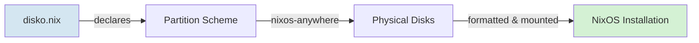

# Disko - Declarative Disk Partitioning for NixOS

## What is Disko?

**Disko** is a NixOS module that allows you to declaratively define your disk partitioning scheme in Nix configuration files. Instead of manually partitioning disks with `fdisk`, `gdisk`, or `parted`, you describe your desired layout in code.

## Why Use Disko?

### Traditional Partitioning Problems:
- 🔴 Manual steps → error-prone
- 🔴 Not reproducible → different every time
- 🔴 Hard to document → tribal knowledge
- 🔴 Doesn't scale → can't repeat for multiple servers

### Disko Advantages:
- ✅ **Declarative** - Describe what you want, not how to create it
- ✅ **Reproducible** - Same config = same disk layout every time
- ✅ **Version controlled** - Your disk layout is in git
- ✅ **Scalable** - Copy config for hyp02, hyp03...
- ✅ **Integrated** - Works seamlessly with nixos-anywhere

## How Disko Works



## Basic Disko Configuration Structure

```nix
{
  disko.devices = {
    disk = {
      <disk-name> = {
        type = "disk";
        device = "/dev/sda";  # Physical device
        content = {
          type = "gpt";  # or "dos" for MBR
          partitions = {
            <partition-name> = {
              size = "512M";  # or "100%" for remaining space
              type = "EF00";  # EFI System (optional)
              content = {
                type = "filesystem";
                format = "vfat";  # or "ext4", "btrfs", etc.
                mountpoint = "/boot";
              };
            };
          };
        };
      };
    };
  };
}
```

## Understanding the Structure

### 1. **Disk Device**
```nix
disk = {
  main = {
    type = "disk";
    device = "/dev/sda";  # The physical disk
```
- `main` - arbitrary name for this disk
- `device` - actual device path (check with `lsblk`)

### 2. **Partition Table Type**
```nix
content = {
  type = "gpt";  # or "dos" (MBR)
```
- `gpt` - Modern systems (UEFI), supports >2TB disks
- `dos` - Legacy systems (BIOS/MBR)

### 3. **Partitions**
```nix
partitions = {
  boot = {
    size = "512M";
    type = "EF00";  # EFI System Partition
```

Common partition types:
- `EF00` - EFI System Partition
- `8300` - Linux filesystem (default)
- `8200` - Linux swap
- `8E00` - Linux LVM

Sizes:
- Specific: `"512M"`, `"1G"`, `"50G"`
- Percentage: `"20%"`
- Remaining: `"100%"` (for last partition)

### 4. **Filesystem Content**
```nix
content = {
  type = "filesystem";
  format = "ext4";
  mountpoint = "/";
  mountOptions = [ "defaults" "noatime" ];
};
```

Supported formats:
- `vfat` - EFI boot partitions
- `ext4` - Standard Linux filesystem
- `btrfs` - Advanced features (snapshots, compression)
- `xfs` - High performance
- `zfs` - Enterprise features

## Example Configurations

### Example 1: Simple Single-Disk Setup (hyp01 default)

```nix
# hosts/hyp01/disko.nix
{
  disko.devices = {
    disk = {
      main = {
        type = "disk";
        device = "/dev/sda";
        content = {
          type = "gpt";
          partitions = {
            boot = {
              size = "512M";
              type = "EF00";
              content = {
                type = "filesystem";
                format = "vfat";
                mountpoint = "/boot";
              };
            };
            root = {
              size = "100%";
              content = {
                type = "filesystem";
                format = "ext4";
                mountpoint = "/";
              };
            };
          };
        };
      };
    };
  };
}
```

**Result:** 
- `/dev/sda1` → 512M → `/boot` (vfat)
- `/dev/sda2` → remaining → `/` (ext4)

### Example 2: With Swap Partition

```nix
{
  disko.devices = {
    disk = {
      main = {
        type = "disk";
        device = "/dev/sda";
        content = {
          type = "gpt";
          partitions = {
            boot = {
              size = "512M";
              type = "EF00";
              content = {
                type = "filesystem";
                format = "vfat";
                mountpoint = "/boot";
              };
            };
            swap = {
              size = "8G";
              content = {
                type = "swap";
              };
            };
            root = {
              size = "100%";
              content = {
                type = "filesystem";
                format = "ext4";
                mountpoint = "/";
              };
            };
          };
        };
      };
    };
  };
}
```

### Example 3: Two Disks - System + VM Storage

Perfect for hypervisor with dedicated VM storage:

```nix
{
  disko.devices = {
    disk = {
      # System disk
      main = {
        type = "disk";
        device = "/dev/sda";
        content = {
          type = "gpt";
          partitions = {
            boot = {
              size = "512M";
              type = "EF00";
              content = {
                type = "filesystem";
                format = "vfat";
                mountpoint = "/boot";
              };
            };
            root = {
              size = "100%";
              content = {
                type = "filesystem";
                format = "ext4";
                mountpoint = "/";
                mountOptions = [ "defaults" "noatime" ];
              };
            };
          };
        };
      };
      
      # Dedicated VM storage disk
      vm-storage = {
        type = "disk";
        device = "/dev/sdb";
        content = {
          type = "gpt";
          partitions = {
            vms = {
              size = "100%";
              content = {
                type = "filesystem";
                format = "ext4";
                mountpoint = "/var/lib/libvirt";
                mountOptions = [ "defaults" "noatime" ];
              };
            };
          };
        };
      };
    };
  };
}
```

### Example 4: Btrfs with Subvolumes

```nix
{
  disko.devices = {
    disk = {
      main = {
        type = "disk";
        device = "/dev/sda";
        content = {
          type = "gpt";
          partitions = {
            boot = {
              size = "512M";
              type = "EF00";
              content = {
                type = "filesystem";
                format = "vfat";
                mountpoint = "/boot";
              };
            };
            root = {
              size = "100%";
              content = {
                type = "btrfs";
                extraArgs = [ "-f" ];
                subvolumes = {
                  "/root" = {
                    mountpoint = "/";
                  };
                  "/home" = {
                    mountpoint = "/home";
                  };
                  "/nix" = {
                    mountpoint = "/nix";
                    mountOptions = [ "compress=zstd" "noatime" ];
                  };
                };
              };
            };
          };
        };
      };
    };
  };
}
```

## Building and Testing Disko Config

### 1. Check Configuration Syntax

```bash
# Verify flake builds correctly
nix flake check

# Build the configuration without installing
nix build .#nixosConfigurations.hyp01.config.system.build.toplevel
```

### 2. Preview Partition Layout

```bash
# Generate partition script (doesn't execute)
nix run github:nix-community/disko -- --mode format --flake .#hyp01 --dry-run
```

This shows what commands disko would run.

### 3. Test in a VM

```bash
# Build a VM with the disko config
nix run github:nix-community/disko -- --mode test --flake .#hyp01
```

### 4. Verify Disk Device Names

Before deployment, check actual disk names on target server:

```bash
ssh root@YOUR_SERVER_IP "lsblk"
ssh root@YOUR_SERVER_IP "ls -la /dev/disk/by-id/"
```

**Pro tip:** Use `/dev/disk/by-id/` for more stable device names:
```nix
device = "/dev/disk/by-id/ata-Samsung_SSD_850_PRO_512GB_S12345";
```

## Using Disko with nixos-anywhere

### Workflow:

```bash
# 1. Update disko.nix with correct disk devices
vim hosts/hyp01/disko.nix

# 2. Verify configuration builds
nix flake check

# 3. Install NixOS remotely
nix run github:nix-community/nixos-anywhere -- \
  --flake .#hyp01 \
  root@YOUR_SERVER_IP
```

nixos-anywhere will:
1. Connect via SSH
2. Load NixOS installer via kexec
3. Read your `disko.nix`
4. **Partition and format disks** according to config
5. Install NixOS
6. Reboot

### Important Flags:

```bash
# Verbose output
--debug

# Skip disk formatting (if already done)
--no-reboot

# Use different SSH key
--ssh-key ~/.ssh/hypervisor_key
```

## Common Patterns for NixLab

### Pattern 1: Basic Hypervisor (Current hyp01)

- Single disk
- EFI boot + root
- Simple and robust

```nix
boot = 512M (vfat) + root = remaining (ext4)
```

### Pattern 2: Hypervisor with Dedicated VM Storage

- System disk: NixOS
- Second disk: VM images

```nix
/dev/sda: boot + root
/dev/sdb: /var/lib/libvirt
```

### Pattern 3: Production Hypervisor

- Swap partition
- Separate disk for VMs
- Backup partition

```nix
/dev/sda: boot + swap + root
/dev/sdb: /var/lib/libvirt
/dev/sdc: /backup
```

## Customizing for Your Setup

### Finding Your Disks

On the target server:
```bash
lsblk -o NAME,SIZE,TYPE,MOUNTPOINT

# Example output:
# NAME   SIZE TYPE MOUNTPOINT
# sda    1TB  disk
# ├─sda1 512M part /boot
# └─sda2 999G part /
# sdb    2TB  disk
# └─sdb1 2TB  part /var/lib/libvirt
```

### Adjusting hyp01 disko.nix

Edit `/home/valdi/Poligon/nixlab/hosts/hyp01/disko.nix`:

```nix
# 1. Change device path
device = "/dev/sda";  # Or /dev/nvme0n1, /dev/vda, etc.

# 2. Adjust partition sizes
boot.size = "1G";     # Larger boot if needed
root.size = "50G";    # Fixed size root

# 3. Add additional partition
data = {
  size = "100%";      # Remaining space
  content = {
    type = "filesystem";
    format = "ext4";
    mountpoint = "/data";
  };
};

# 4. Enable second disk (uncomment vm-storage section)
```

## Troubleshooting

### Issue: Wrong device name
```
Error: Device /dev/sda not found
```
**Solution:** Check actual device names with `lsblk` and update `disko.nix`

### Issue: Disk not empty
```
Error: Device already has partitions
```
**Solution:** Disko won't touch existing partitions by default. Either:
- Manually wipe disk first: `wipefs -a /dev/sda`
- Or use `--mode destroy` with nixos-anywhere (⚠️ DESTRUCTIVE!)

### Issue: Not enough space
```
Error: Not enough space for partition
```
**Solution:** Check total sizes don't exceed disk capacity:
```bash
ssh root@SERVER "lsblk -b /dev/sda"  # Size in bytes
```

## Best Practices

1. ✅ **Version control** - Keep disko.nix in git
2. ✅ **Test first** - Use `--dry-run` before actual deployment
3. ✅ **Document disks** - Add comments about which physical disk is which
4. ✅ **Use stable names** - Prefer `/dev/disk/by-id/` over `/dev/sda`
5. ✅ **Backup** - Always backup before running disko on existing systems
6. ✅ **Match reality** - Verify device names on actual hardware

## Next Steps

1. Review `hosts/hyp01/disko.nix`
2. Adjust device paths for your hardware
3. Test with `nix flake check`
4. Deploy with nixos-anywhere

## References

- [Disko Official Docs](https://github.com/nix-community/disko)
- [Disko Examples](https://github.com/nix-community/disko/tree/master/example)
- [nixos-anywhere Guide](https://github.com/nix-community/nixos-anywhere)
