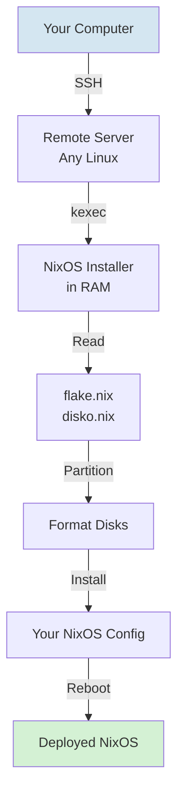

# nixos-anywhere Deployment Guide

## What is nixos-anywhere?

**nixos-anywhere** is a tool for installing NixOS on remote servers without requiring physical access or pre-installed NixOS. It uses `kexec` to load a NixOS installer into RAM, then installs your declarative configuration.

## How It Works



## Prerequisites

### On Your Computer:
- Nix with flakes enabled
- SSH access to target server
- Your nixlab flake configured

### On Target Server:
- Any Linux distribution (Debian, Ubuntu, Fedora, etc.)
- SSH access as root
- Internet connection
- Sufficient RAM (2GB+ recommended)

## Installation Steps

### Step 1: Prepare SSH Access

Ensure you can SSH as root to your server:

```bash
# Test SSH connection
ssh root@YOUR_SERVER_IP

# If needed, copy your SSH key
ssh-copy-id root@YOUR_SERVER_IP
```

### Step 2: Identify Disk Devices

On the target server, identify your disks:

```bash
# List all disks
lsblk

# Get detailed disk info
lsblk -o NAME,SIZE,TYPE,MOUNTPOINT,MODEL

# List by stable ID (recommended)
ls -la /dev/disk/by-id/
```

Example output:
```
NAME   SIZE TYPE MOUNTPOINT
sda    1TB  disk
├─sda1 512M part /boot
└─sda2 999G part /
sdb    2TB  disk
```

### Step 3: Update disko.nix

Edit `hosts/hyp01/disko.nix` with correct device paths:

```nix
{
  disko.devices = {
    disk = {
      main = {
        type = "disk";
        device = "/dev/sda";  # ← Update this!
        # ... rest of config
      };
    };
  };
}
```

**Pro Tip:** Use stable device names:
```nix
device = "/dev/disk/by-id/ata-Samsung_SSD_850_PRO_512GB_S12345";
```

### Step 4: Verify Configuration

```bash
# Ensure flake is valid
nix flake check

# Build configuration locally (doesn't install)
nix build .#nixosConfigurations.hyp01.config.system.build.toplevel

# Preview disko partitioning (dry-run)
nix run github:nix-community/disko -- \
  --mode format \
  --flake .#hyp01 \
  --dry-run
```

### Step 5: Deploy with nixos-anywhere

```bash
# Deploy!
nix run github:nix-community/nixos-anywhere -- \
  --flake .#hyp01 \
  root@YOUR_SERVER_IP
```

What happens:
1. Connects via SSH
2. Uploads NixOS installer via kexec
3. Server reboots into installer (in RAM)
4. Reconnects via SSH
5. Partitions disks per `disko.nix`
6. Installs NixOS from your `flake.nix`
7. Reboots into new system

**Duration:** Typically 10-15 minutes depending on internet speed.

## Advanced Options

### Custom SSH Key

```bash
nix run github:nix-community/nixos-anywhere -- \
  --flake .#hyp01 \
  --ssh-key ~/.ssh/hypervisor_key \
  root@YOUR_SERVER_IP
```

### Debug Mode

```bash
nix run github:nix-community/nixos-anywhere -- \
  --flake .#hyp01 \
  --debug \
  root@YOUR_SERVER_IP
```

### Skip Reboot (Manual Reboot)

```bash
nix run github:nix-community/nixos-anywhere -- \
  --flake .#hyp01 \
  --no-reboot \
  root@YOUR_SERVER_IP
```

### Using Environment Variables

```bash
# Set target host
export TARGET_HOST=root@10.0.0.100

# Set flake
export FLAKE=.#hyp01

# Deploy
nix run github:nix-community/nixos-anywhere -- \
  --flake "$FLAKE" \
  "$TARGET_HOST"
```

## Complete Deployment Workflow

### Initial Installation

```bash
# 1. Clone/navigate to nixlab
cd /home/valdi/Poligon/nixlab

# 2. Update hardware-specific settings
vim hosts/hyp01/disko.nix        # Set disk devices
vim hosts/hyp01/networking.nix   # Verify interface names

# 3. Verify config
nix flake check

# 4. Deploy
nix run github:nix-community/nixos-anywhere -- \
  --flake .#hyp01 \
  root@YOUR_CURRENT_IP
```

### After First Boot

The server will have:
- Management IP: `10.20.0.30` (on br20)
- SSH enabled
- All your configured packages
- Libvirt ready for VMs

```bash
# Verify system is up
ssh root@10.20.0.30

# Check system version
nixos-version

# Verify libvirt
virsh list --all
```

### Subsequent Updates (Use deploy-rs)

After initial installation, use deploy-rs for updates:

```bash
# Make changes to configuration
vim hosts/hyp01/configuration.nix

# Deploy updates
nix run github:serokell/deploy-rs -- .#hyp01
```

## Deployment for Multiple Hypervisors

### Adding hyp02

```bash
# 1. Copy hyp01 configuration
cp -r hosts/hyp01 hosts/hyp02

# 2. Update configuration
vim hosts/hyp02/configuration.nix   # Change hostname
vim hosts/hyp02/networking.nix      # Change IPs (10.20.0.31, 10.30.0.31, etc.)
vim hosts/hyp02/disko.nix           # Update disk devices if different

# 3. Add to flake.nix
vim flake.nix  # Add hyp02 to nixosConfigurations and deploy.nodes

# 4. Deploy
nix run github:nix-community/nixos-anywhere -- \
  --flake .#hyp02 \
  root@HYP02_IP
```

## Troubleshooting

### Issue: SSH Connection Failed

```
Error: Could not connect to root@SERVER_IP
```

**Solutions:**
- Verify SSH works: `ssh root@SERVER_IP`
- Check firewall allows SSH (port 22)
- Ensure correct IP address
- Try with specific key: `--ssh-key ~/.ssh/id_ed25519`

### Issue: kexec Failed

```
Error: kexec failed to load
```

**Solutions:**
- Server may not support kexec (very rare)
- Try different Linux distribution on server
- Check server has enough RAM (2GB minimum)

### Issue: Disk Not Found

```
Error: Device /dev/sda not found
```

**Solutions:**
- Check device name with `lsblk` on server
- Update `disko.nix` with correct device
- Use `/dev/disk/by-id/` for stable naming

### Issue: Partition Already Exists

```
Error: Partition table exists on /dev/sda
```

**Solutions:**
Disko won't overwrite by default. Either:

1. **Manually wipe disk** (⚠️ DESTRUCTIVE):
```bash
ssh root@SERVER_IP "wipefs -a /dev/sda"
```

2. **Force with nixos-anywhere**:
```bash
nix run github:nix-community/nixos-anywhere -- \
  --flake .#hyp01 \
  --mode destroy \
  root@SERVER_IP
```

### Issue: Installation Hangs

**Solutions:**
- Check internet connection on server
- Monitor with `--debug` flag
- Check server logs: `journalctl -f` (on server)

### Issue: Can't SSH After Install

```
Error: Connection refused to 10.20.0.30
```

**Solutions:**
- Check if server rebooted successfully
- Try original IP (network config may have failed)
- Connect via console/KVM to debug
- Verify networking.nix has correct interface name

## Rollback

If installation fails or you need to start over:

```bash
# Boot server from original Linux
# Wipe disks
ssh root@SERVER_IP "wipefs -a /dev/sda"

# Re-run nixos-anywhere
nix run github:nix-community/nixos-anywhere -- \
  --flake .#hyp01 \
  root@SERVER_IP
```

## Verification Checklist

After deployment, verify:

```bash
# 1. SSH works
ssh root@10.20.0.30

# 2. Check NixOS version
nixos-version

# 3. Verify network bridges
ip link show
# Should see: br10, br20, br30, br40

# 4. Check libvirt
systemctl status libvirtd
virsh list --all

# 5. Verify system packages
which vim git htop

# 6. Check disk mounts
df -h
lsblk
```

## Production Considerations

### Before Deploying to Production:

1. **Backup existing data** (if any)
2. **Test configuration** in VM first
3. **Have console access** (KVM/IPMI) as backup
4. **Document disk layout** for your specific hardware
5. **Keep old system available** (dual boot or separate disk)

### Network Configuration:

Ensure your network infrastructure supports:
- VLAN 20, 30, 40 (if using tagged VLANs)
- Management IP `10.20.0.30` is routable
- Firewall allows SSH to management IP

### Post-Installation:

```bash
# Set root password (if not using SSH keys only)
ssh root@10.20.0.30 "passwd"

# Create non-root user (optional)
# Add to configuration.nix:
users.users.admin = {
  isNormalUser = true;
  extraGroups = [ "wheel" "libvirtd" ];
  openssh.authorizedKeys.keys = [ "ssh-ed25519 AAAA..." ];
};

# Deploy change
nix run github:serokell/deploy-rs -- .#hyp01
```

## Complete Example Session

```bash
# Start with server running Debian/Ubuntu
$ ssh root@192.168.1.100
root@debian:~# lsblk
NAME   SIZE TYPE
sda    500G disk
sdb    2TB  disk

root@debian:~# exit

# On your computer
$ cd /home/valdi/Poligon/nixlab

# Update disko config
$ vim hosts/hyp01/disko.nix
# Set device = "/dev/sda" for main
# Uncomment vm-storage section
# Set device = "/dev/sdb" for vm-storage

# Verify
$ nix flake check
$ nix build .#nixosConfigurations.hyp01.config.system.build.toplevel

# Deploy
$ nix run github:nix-community/nixos-anywhere -- \
    --flake .#hyp01 \
    root@192.168.1.100

# Wait 10-15 minutes...
# Server reboots

# Test new system
$ ssh root@10.20.0.30
root@hyp01:~# nixos-version
24.05.20241230.b134951 (Uakari)

root@hyp01:~# virsh list --all
 Id   Name   State
--------------------

# Success! 🎉
```

## Next Steps

After successful deployment:

1. **Test VMs**: Deploy your first Talos VM
2. **Configure backup**: Set up automated backups
3. **Monitor**: Add monitoring tools
4. **Scale**: Deploy hyp02, hyp03 using same method

## Resources

- [nixos-anywhere GitHub](https://github.com/nix-community/nixos-anywhere)
- [Disko Documentation](https://github.com/nix-community/disko)
- [NixOS Manual](https://nixos.org/manual/nixos/stable/)
- [NixLab DISKO_GUIDE.md](DISKO_GUIDE.md)
